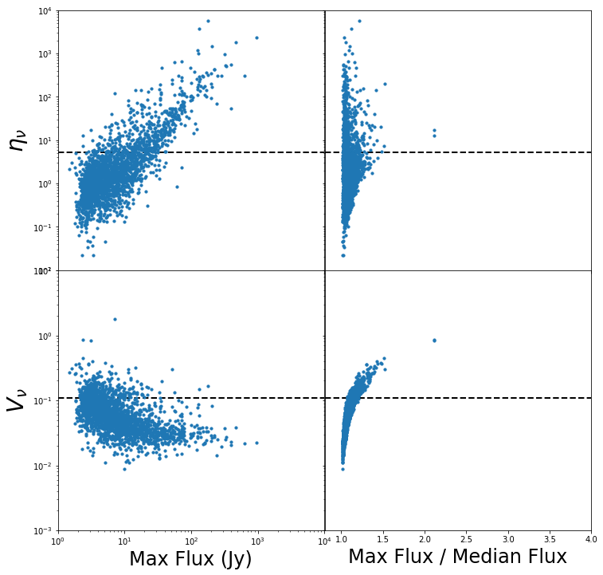
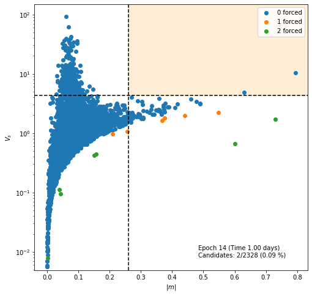
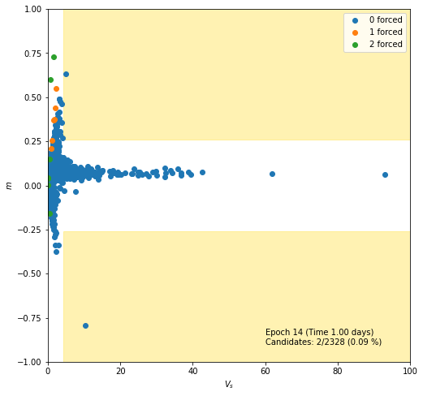
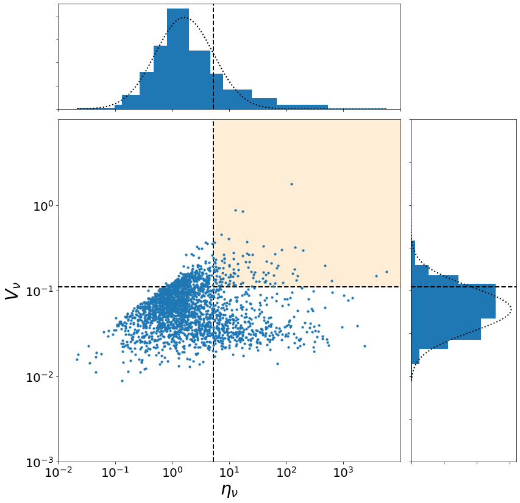

# Pipeline

This class provides methods to load and interact with results from the [VAST Pipeline](https://vast-survey.org/vast-pipeline/){:target="_blank"}.
There are ready made functions to:

  * Load the pipeline outputs into dataframes ready for analysis.
  * Explore individual sources.
  * Run provided transient and variability searches.
  * Check for the Sun, Moon and planets in the pipeline run.
  * Recalculate the `sources` data after filters have been applied.
  * Create a MOC of the pipeline run.

!!!warning "Warning: Data Access"
    It is assumed that the machine that is running VAST Tools has access to the pipeline output and the images that were used in the pipeline.
    Refer to the [Configuration & Data Access](../../getting_started/configuration/) page for more information.

## Using the Pipeline Component

!!!info "Info: VAST Pipeline Example Notebook"
    An example notebook of using the Pipeline component can be found in the example notebooks section [here](../../notebook-examples/vast-pipeline-example/).
    Using the pipeline results to crossmatch to external catalogues is also demonstrated in the [catalogue crossmatch example notebook](../../notebook-examples/catalogue-crossmatching-example/).

The first step is to initialise a `Pipeline` instance from `vasttools.pipeline`:

!!!example
    ```python
    from vasttools.pipeline import Pipeline

    pipe = Pipeline()
    ```

If configured correctly, VAST Tools should automatically detected where the Pipeline directory is located on the system.
If this is not the case then the variable `project_dir` can be passed when initialising the instance to define where the pipeline outputs are located.
Refer to the [Configuration & Data Access](../../getting_started/configuration/) page for more information.

!!!example "Example: Defining the Project Directory"
    ```python
    pipe = Pipeline(project_dir='/path/to/the/pipeline-runs/')
    ```

### Available Pipeline Methods

The following methods are available with the `Pipeline` instance.

!!!info "Info: Code Reference"
    Each method below has a link to the Code Reference section which provides full details of the method, including the arguments.

#### list_images

:fontawesome-regular-file-lines: [Code reference](../../reference/pipeline/#vasttools.pipeline.Pipeline.list_images).

Provides a list of all the images that have been processed in the pipeline.

!!!example
    ```python
    pipe.list_images()
    ```
    Output:
    ```terminal
     ['VAST_2118+00A_EPOCH01_I_fits',
     'VAST_2118-06A_EPOCH01_I_fits',
     'VAST_2118-06A_EPOCH02_I_fits',
     'VAST_2118-06A_EPOCH03x_I_fits',
     'VAST_2118-06A_EPOCH05x_I_fits',
     'VAST_2118-06A_EPOCH06x_I_fits']
    ```

#### list_piperuns

:fontawesome-regular-file-lines: [Code reference](../../reference/pipeline/#vasttools.pipeline.Pipeline.list_piperuns).

Provides a list of all the pipeline runs that have been set up in the pipeline.

!!!note "Note: Pipeline Runs"
    This works by searching for the created directories in the pipeline output folder.
    Hence, pipeline runs listed here may not have been successfully completed.

!!!example
    ```python
    pipe.list_piperuns()
    ```
    Output:
    ```terminal
    ['S190814bv',
     'VAST_0127-73A',
     'VAST_2118-06A_UI']
    ```

#### load_run

:fontawesome-regular-file-lines: [Code reference](../../reference/pipeline/#vasttools.pipeline.Pipeline.load_run).

Loads the pipeline run requested returning a `vasttools.pipeline.PipeAnalysis` instance (see sections below).

!!!example
    Load the pipeline run named `pilot_survey`
    ```python
    my_pipe_run = pipe.load_run('pilot_survey')
    ```

#### load_runs

:fontawesome-regular-file-lines: [Code reference](../../reference/pipeline/#vasttools.pipeline.Pipeline.load_runs).

Loads multiple pipeline runs that are requested and merges them to return a single `vasttools.pipeline.PipeAnalysis` instance (see sections below).

!!!warning "Warning: Same Pipeline Assumption"
    It is assumed you are loading runs from the same Pipeline instance. 
    If this is not the case then erroneous results may be returned.

!!!example
    Load the two runs `pilot_survey` and `pilot_survey_phase_2`.
    ```python
    my_pipe_run = pipe.load_runs(['pilot_survey', 'pilot_survey_phase_2'])
    ```

### PipeAnalysis Instances

A loaded run using the `Pipeline.load_run()` method is returned as a `vasttools.pipeline.PipeAnalysis` instance.
This object contains the loaded raw data of the pipeline as well has having access to various methods to perform common analysis tasks.
The sections below detail what data and methods are available.

### Accessing PipeAnalysis Run Data

:fontawesome-regular-file-lines: [Code reference](../../reference/pipeline/#vasttools.pipeline.PipeAnalysis).

The run data is stored as attributes to the `PipeAnalysis` object, which are all shown in the table below.
This means that to access any of the pieces of pipeline run data, for example `sources`, the command would be:

!!!example "Example: Accessing the Pipeline Data"
    Accessing the `source` attribute from the `PipeAnalysis` object stored as `my_pipe_run`.
    ```python
    my_pipe_run.sources
    ```
    Output:
    
    |   id |   wavg_ra |   wavg_dec |   avg_compactness |   min_snr |   max_snr |   wavg_uncertainty_ew |   wavg_uncertainty_ns |   avg_flux_int |   avg_flux_peak |   max_flux_peak |   max_flux_int |   min_flux_peak |   min_flux_int |   min_flux_peak_isl_ratio |   min_flux_int_isl_ratio |    v_int |    v_peak |   eta_int |   eta_peak | new   |   new_high_sigma |   n_neighbour_dist |   vs_abs_significant_max_peak |   m_abs_significant_max_peak |   vs_abs_significant_max_int |   m_abs_significant_max_int |   n_measurements |   n_selavy |   n_forced |   n_siblings |   n_relations |
    |-----:|----------:|-----------:|------------------:|----------:|----------:|----------------------:|----------------------:|---------------:|----------------:|----------------:|---------------:|----------------:|---------------:|--------------------------:|-------------------------:|---------:|----------:|----------:|-----------:|:------|-----------------:|-------------------:|------------------------------:|-----------------------------:|-----------------------------:|----------------------------:|-----------------:|-----------:|-----------:|-------------:|--------------:|
    |    1 |   321.973 |   0.699851 |          1.19165  |   50.0035 |   50.0035 |           0.000282565 |           0.000282565 |        17.161  |         14.401  |          14.401 |         17.161 |          14.401 |         17.161 |                         1 |                        1 | 0        | 0         |    0      |    0       | False |                0 |          0.0797685 |                       0       |                     0        |                       0      |                    0        |                1 |          1 |          0 |            0 |             0 |
    |    2 |   323.714 |  -2.60374  |          0.984136 |   35.6238 |   50.4427 |           0.000115396 |           0.000115396 |        14.8353 |         15.056  |          16.293 |         18.188 |          14.278 |         10.097 |                         1 |                        1 | 0.220432 | 0.0483071 |   34.0201 |    4.77011 | False |                0 |          0.0671826 |                       4.37252 |                     0.131824 |                       9.7928 |                    0.572105 |                6 |          6 |          0 |            0 |             0 |
    |    3 |   322.062 |  -3.65218  |          1.10679  |   28.9505 |   51.573  |           0.00011714  |           0.00011714  |        11.2827 |         10.2657 |          14.492 |         17.725 |           7.602 |          8.53  |                         1 |                        1 | 0.318601 | 0.320678  |   44.727  |  144.446   | False |                0 |          0.0483475 |                      18.271   |                     0.623699 |                      12.2216 |                    0.700438 |                6 |          6 |          0 |            0 |             0 |
    |    4 |   316.332 |  -2.60898  |          1.11456  |   52.4078 |   64.4311 |           0.000114767 |           0.000114767 |        15.6558 |         14.0617 |          14.497 |         19.35  |          13.364 |         12.002 |                         1 |                        1 | 0.166578 | 0.0334684 |   35.3403 |    3.70799 | False |                0 |          0.0724847 |                       0       |                     0        |                      10.9505 |                    0.468742 |                6 |          6 |          0 |            0 |             0 |
    |    5 |   323.796 |   1.83018  |          1.0673   |   40.236  |   40.236  |           0.000284353 |           0.000284353 |        15.288  |         14.324  |          14.324 |         15.288 |          14.324 |         15.288 |                         1 |                        1 | 0        | 0         |    0      |    0       | False |                0 |          0.0485506 |                       0       |                     0        |                       0      |                    0        |                1 |          1 |          0 |            0 |             0 |
    |    ... |   ... |   ...  |         ...   |   ...  |   ...  |           ... |           ... |        ... |         ...  |          ... |         ... |          ... |         ... |                         ... |                        ... | ...        | ...         |    ...      |    ...       | ... |                ... |          ... |                     ...       |                   ...        |                     ...      |                    ...      |              ... |        ... |        ... |          ... |           ... |

!!!info "Info: VAST Pipeline Outputs"
    Refer to [this page](https://vast-survey.org/vast-pipeline/outputs/outputs/){:target="_blank"} in the VAST Pipeline documentation for details on the Pipeline outputs.

| **Attribute Name** | **Description**                                                                                                                    |
| ------------------ | ---------------------------------------------------------------------------------------------------------------------------------- |
| `associations`     | The pipeline output `associations.parquet` loaded into a pandas dataframe.                                                         |
| `images`           | The pipeline output `images.parqeut` loaded into a pandas dataframe.                                                               |
| `measurements`     | The pipeline output `measurements.parquet` or `measurements.arrow` loaded into a pandas dataframe or vaex dataframe, respectively. |
| `relations`        | The pipeline output `relations.parqeut` loaded into a pandas dataframe.                                                            |
| `skyregions`       | The pipeline output `skyregions.parqeut` loaded into a pandas dataframe.                                                           |
| `sources`          | The pipeline output `sources.parqeut` loaded into a pandas dataframe.                                                              |
| `sources_skycoord` | A `astropy.coords.SkyCoordinate` instance of the all the `sources` positions for convenience.                                      |

!!!info "Info: vaex"
    For large pipeline runs, the individual measurements of the run are loaded into a `vaex` dataframe, instead of using `pandas`.
    `vaex` is a recently developed data analysis package that loads data in an 'out-of-core' context, which means the data is not loaded into memory.
    This makes the exploration much faster and lightweight, but `vaex` does have some differences to `pandas`.
    It is recommended to refer to the [`vaex` documentation](https://vaex.io/docs/index.html){:target="_blank"} if you are new to the package.
    
    User warnings will appear when `vaex` has been used to load data.

### Available PipeAnalysis Methods

The following methods are available to the `PipeAnalysis` instance.

???note "Dev Note"
    The `PipeAnalysis` object inherits from `vasttools.pipeline.PipeRun`, hence, some of the methods are attached to this
    object in the [`Code Reference`](../../reference/pipeline/) section.

#### check_for_planets

:fontawesome-regular-file-lines: [Code reference](../../reference/pipeline/#vasttools.pipeline.PipeRun.check_for_planets).

Checks to see if any of the planets, including Pluto, the Sun and the Moon, are observable at any time in the pipeline run.
A pandas dataframe will be returned containing the positions of found objects. 
An empty dataframe will be returned if no objects are in the pipeline run.

The columns of the returned dataframe are:

  * `DATEOBS` The date of the observation (image) being checked.
  * `centre-ra` The right ascension coordinate of the image centre in degrees.
  * `centre-dec` The declination coordinate of the image centre in degrees.
  * `planet` The name of the planet.
  * `ra` The right ascension coordinate of the planet location in degrees.
  * `dec` The declination coordinate of the planet location in degrees.
  * `sep` The on-sky separation between the planet location and the image centre in degrees.

!!!example
    ```python
    planets = my_pipe_run.check_for_planets()
    ```

#### combine_with_run

:fontawesome-regular-file-lines: [Code reference](../../reference/pipeline/#vasttools.pipeline.PipeRun.combine_with_run).

Combines the current run with another `PipeAnalysis` object that has been loaded, i.e. a second pipeline run.
It returns a new `PipeAnalysis` object with the two runs combined.

!!!warning "Warning: Same Pipeline Assumption"
    It is assumed you are loading runs from the same Pipeline instance. 
    If this is not the case then erroneous results may be returned.

!!!example
    Combines `my_pipe_run` with another run defined as `my_second_pipe_run`.
    ```python
    my_new_pipe_run = my_pipe_run.combine_with_run(my_second_pipe_run)
    ```

#### create_moc

:fontawesome-regular-file-lines: [Code reference](../../reference/pipeline/#vasttools.pipeline.PipeRun.create_moc).

This creates a Multi-Order Coverage map for the area covered by the pipeline run. 

!!!warning "Warning: Long Processing Time"
    This is not recommended for pipeline runs with a lot of images (> 200) as the process can take a very long time.

!!!example
    ```python
    my_pipe_run_moc = my_pipe_run.create_moc()
    ```

#### filter_by_moc

:fontawesome-regular-file-lines: [Code reference](../../reference/pipeline/#vasttools.pipeline.PipeRun.filter_by_moc).

Returns a new `PipeAnalysis` instance that has had all data filtered to only include data of sources that are within a supplied MOC.

!!!example
    Filtering the pipeline run by a MOC defined by `my_moc`.
    ```python
    my_pipe_run_filtered = my_pipe_run.filter_by_moc(my_moc)
    ```

#### get_source

:fontawesome-regular-file-lines: [Code reference](../../reference/pipeline/#vasttools.pipeline.PipeRun.get_source).

Fetches a specific source from the pipeline run, and returns a `vasttools.source.Source` instance.
The source is selected by using the ID value.

!!!info "Info: A VAST Tools Source"
    A `vasttools.source.Source` object has the ability to plot lightcurves, postage stamps and to search for images of the source in other surveys.
    Refer to the [Source page](source.md) of this documentation to learn more about `vasttools.source.Source` objects.

!!!example
    Seleting a source with ID `500`.
    ```python
    my_source = my_pipe_run.get_source(500)
    ```

#### get_sources_skycoord

:fontawesome-regular-file-lines: [Code reference](../../reference/pipeline/#vasttools.pipeline.PipeRun.get_sources_skycoord).

A convenience function to generate a `SkyCoord` object of all the sources in the `PipeAnalysis.sources` attribute.
Returns a `astropy.coordines.SkyCoord` instance.

!!!tip "Tip: Custom Source dataframe"
    The method can also generate a SkyCoord from a provided sources dataframe.
    Check the [Code reference](../../reference/pipeline/#vasttools.pipeline.PipeRun.get_sources_skycoord) for more details.

!!!example
    ```python
    sources_skycoord = my_pipe_run.get_sources_skycoord()
    ```

#### load_two_epoch_metrics

:fontawesome-regular-file-lines: [Code reference](../../reference/pipeline/#vasttools.pipeline.PipeRun.load_two_epoch_metrics).

By default the raw two-epoch metrics produced by the pipeline are not loaded.
This method loads the two-epoch metrics, stored by the pipeline in `measurement_pairs.parquet` (or `measurement_pairs.arrow`) and saves them as an attribute to the `PipeAnalysis` object: `PipeAnalysis.measurement_pairs_df`.
The method also creates a second dataframe that lists all the possible epoch pairs, i.e., all the unique pairs of images that make up the measurement pairs.
This is stored as the attribute `PipeAnalysis.pairs_df`.

!!!warning "Warning: vaex"
    For large runs where a `measurement_pairs.arrow` file has been produced by the pipeline, `vaex` will be used to load the `measurement_pairs` dataframe.
    A user warning will be given when `vaex` is used.

!!!info "Info: Two Epoch Metrics"
    Refer to [this page](https://vast-survey.org/vast-pipeline/design/sourcestats/#two-epoch-metrics){:target="_blank"} in the VAST Pipeline documentation to learn more about the two-epoch metrics.

!!!example
    Loading the two-epoch metrics.
    ```python
    my_pipe_run.load_two_epoch_metrics()
    ```
    Which will create the following attributes:
    ```python
    my_pipe_run.measurement_pairs_df
    my_pipe_run.pairs_df
    ```

#### recalc_measurement_pairs_df

:fontawesome-regular-file-lines: [Code reference](../../reference/pipeline/#vasttools.pipeline.PipeAnalysis.recalc_measurement_pairs_df).

!!! warning "Warning: Run Time & Memory"
    Beware that for large pipeline runs the recalculation can take some time to complete and use up considerable memory.
    On a shared instance, e.g. a Jupyter Hub environment, the admin may need to be consulted to allow for enough memory access.

A method to recalculate the measurement pairs dataframe using a provided measurements dataframe that is assumed to have been edited.
For example, some measurements could have been removed or the fluxes could have been changed to corrected values.

!!! tip
    The result of this method can be used with [`recalc_sources_df`](#recalc_sources_df) to update the significant `vs` and `m` columns in the sources dataframe.

!!!example
    ```python
    new_measurement_pairs = my_pipe_run.recalc_measurement_pairs_df(my_filtered_measurements)
    ```

#### recalc_sources_df

:fontawesome-regular-file-lines: [Code reference](../../reference/pipeline/#vasttools.pipeline.PipeAnalysis.recalc_sources_df).

!!! warning "Warning: Run Time & Memory"
    Beware that for large pipeline runs the recalculation can take some time to complete and use up considerable memory.
    On a shared instance, e.g. a Jupyter Hub environment, the admin may need to be consulted to allow for enough memory access.

This method recalculates the `sources` dataframe using the provided `measurements` dataframe.
In particular, all the columns that are averages, counts or the variability metrics are recalculated.
It is useful for cases where measurements are filtered out of the original measurements dataframe, or have fluxes changed, and hence the `source` dataframe becomes out of sync.
Returns a pandas dataframe.

!!! tip "Tip: Changed Measurement Fluxes"
    If the measurement fluxes have been changed then a recalculated measurement pairs dataframe should be provided in order to calculate the correct new values of the significant `vs` and `m` columns.
    A recalculated pairs dataframe can be obtained from the [`recalc_measurement_pairs_df`](#recalc_measurement_pairs_df) detailed on this page, and can be supplied using the `measurement_pairs_df` argument.
    See the example section below on how to supply the dataframe.
    
    If no measurement pairs dataframe is provided then a filtered measurement pairs dataframe will be used to calculate the new columns with the original fluxes.

!!! warning "Warning: Not Recalculated"
    Two metrics are not re-calculated:
    
      * `new`
      * `new_source_high_sigma`
      
    As these metrics are too complex to recalculate in this environment.

!!!example
    ```python
    new_sources_df = my_pipe_run.recalc_sources_df(my_filtered_measurements)
    ```
    Or with a corrected measurement pairs dataframe:
    ```python
    new_measurement_pairs = my_pipe_run.recalc_measurement_pairs_df(my_filtered_measurements)
    
    new_sources_df = my_pipe_run.recalc_sources_df(
        my_filtered_measurements, measurement_pairs_df=new_measurement_pairs)
    ```
    The new sources could then be assigned to the pipeline run if desired:
    ```python
    my_pipe_run.sources = new_sources_df
    ```

### Available PipeAnalysis Transient Analysis Methods

The following methods are designed to perform common transient search analyses and plots on the loaded pipeline run data, including the production of useful plots.

!!!info "Info: Variability Statistics"
    Refer to [this page](https://vast-survey.org/vast-pipeline/design/sourcestats/#variability-statistics) in the VAST Pipeline documentation to learn more about the variability metrics the pipeline provides.

#### eta_v_diagnostic_plot

:fontawesome-regular-file-lines: [Code reference](../../reference/pipeline/#vasttools.pipeline.PipeAnalysis.eta_v_diagnostic_plot).

Produces a diagnostic plot using the η and V metrics as described in [Rowlinson et al., 2019](https://ui.adsabs.harvard.edu/abs/2019A%26C....27..111R/abstract).
Returns a `matplotlib.pyplot.figure` instance.

!!!example
    ```python
    diag_plot = my_pipe_run.eta_v_diagnostic_plot()
    ```

??? example "Example Plot"
    {: loading=lazy }

#### plot_two_epoch_pairs

:fontawesome-regular-file-lines: [Code reference](../../reference/pipeline/#vasttools.pipeline.PipeAnalysis.plot_two_epoch_pairs).

Produce a two-epoch metric plot of the `m` and `vs` values of the requested pair ID (i.e. the pair of images).
The pair ID can be found in the `pairs_df` attribute after [`load_two_epoch_metrics()`](#load_two_epoch_metrics) has been used.
There are options to change the `m_min` and `vs_min` thresholds and to switch to using integrated flux instead of the peak flux (default).
The plots can be returned as a `matplotlib.pyplot.figure` instance or a `bokeh.plotting.figure` instance.
Also available are two styles, style `a` follows the plot style found in [Mooley et al., 2016](https://ui.adsabs.harvard.edu/abs/2016ApJ...818..105M/abstract) 
where as style `b` follows the style found in [Radcliffe et al., 2019](https://ui.adsabs.harvard.edu/abs/2019MNRAS.490.4024R/abstract).

!!!tip "Tip: Query String"
    This method has the ability to pass a query string. 
    See the tip in [`run_eta_v_analysis`](#run_eta_v_analysis) for details.

!!! warning "Warning: Bokeh Output"
    Remember that the `output_notebook` must be initialised in order to view any bokeh output in a Jupyter Notebook environment.
    ```python
    from bokeh.io import output_notebook

    output_notebook()
    ```

!!!example
    Plot the two epoch pairs for pair with ID 14.
    ```python
    two_epoch_plot = my_pipe_run.plot_two_epoch_pairs(14)
    ```

??? example "Example Plot Style a"
    {: loading=lazy }

??? example "Example Plot Style b"
    {: loading=lazy }

#### run_eta_v_analysis

:fontawesome-regular-file-lines: [Code reference](../../reference/pipeline/#vasttools.pipeline.PipeAnalysis.run_eta_v_analysis).

Method to perform the η-V transient search method as described in [Rowlinson et al., 2019](https://ui.adsabs.harvard.edu/abs/2019A%26C....27..111R/abstract), to the sigma level provided for each metric.
It uses the η and V metrics defined in the `sources` dataframe.
The distributions of η and V in the `sources` dataframe are fitted with a Gaussian, which is then used to calculate the requested sigma value for each parameter.
Any sources that have η and V values above the calculated thresholds are considered as variable candidates.

The method returns a tuple containing:
  
  * η cutoff value,
  * the V cutoff value,
  * dataframe of candidates,
  * candidates plot,
  * the diagnostic plot (optional).

The η and V cutoff values are the calculated values for the provided sigma limit.
The candidates dataframe contains any sources that exceed both the η and V thresholds (found in the top right-hand quadrant of the plot). 
The candidates plot can either be a `matplotlib.pyplot.figure` or `bokeh.layouts.gridplot` instance.

!!!tip "Tip: Query String"
    This method allows the user to pass a `query` to the method which is a string representation of a query that is used with the 
    [`pandas.DataFrame.query`](https://pandas.pydata.org/pandas-docs/stable/reference/api/pandas.DataFrame.query.html){:target="_blank"}
    method on the `sources` dataframe.
    
    For example, using the column names of the `sources` dataframe that can be found in the VAST Pipeline documentation 
    [here](https://vast-survey.org/vast-pipeline/outputs/coldesc/#sources){:target="_blank"}, the following query could be defined:
    ```python
    my_query_string = (
        "n_measurements >= 3 "
        "& n_relations == 0 "
        "& min_snr >= 7.0"
    )
    ```
    Which translates to asking for sources that:

      * have 3 or more measurements,
      * have no relations,
      * and have a minimum SNR greater of equal to 7.
      
    This is useful in order to dynamically apply filters rather than permenently filtering the sources dataframe.
    
    It is passed to the method using the keyword argument `query`:
    ```python
    eta_thresh, v_thresh, eta_v_candidates, plot = my_run.run_eta_v_analysis(1.0, 1.0, query=my_query_string)
    ```
    Check the [`Code Reference`](../../reference/pipeline/) section of this documentation for full details of the arguments.

!!! warning "Warning: Bokeh Slow Down"
    A bokeh plot with thousands of datapoints from large pipeline runs may cause the notebook to suffer from slowdown.

!!!example
    Run the η-V process using threshold sigma values of 1.0 for each metric.
    ```python
    eta_thresh, v_thresh, eta_v_candidates, plot = my_run.run_eta_v_analysis(1.0, 1.0)
    ```

??? example "Example Plot"
    {: loading=lazy }

#### run_two_epoch_analysis

:fontawesome-regular-file-lines: [Code reference](../../reference/pipeline/#vasttools.pipeline.PipeAnalysis.run_two_epoch_analysis).

Method to perform the two epoch analysis as detailed in [Mooley et al., 2016](https://ui.adsabs.harvard.edu/abs/2016ApJ...818..105M/abstract) to the provided `m` and `vs` threshold values.
The entire `measurement_pairs_df` is analysed for any pair that exceed the two provided thresholds.

The method returns a tuple containing two dataframes: the candidate sources and pairs. 
The candidate sources are the unique sources that have at least one measurement pair that exceed the threshold.
The candidate pairs are all the measurement pairs that exceed the provided thresholds.

!!!tip "Tip: Query String"
    This method has the ability to pass a query string. 
    See the tip in [`run_eta_v_analysis`](#run_eta_v_analysis) for details.

!!!example
    Run the two-epoch process with thresholds of `v >= 4.3` and `m >= 0.26`.
    ```python
    two_epoch_candidate_sources, two_epoch_candidate_pairs = my_run.run_two_epoch_analysis(4.3, 0.26)
    ```
