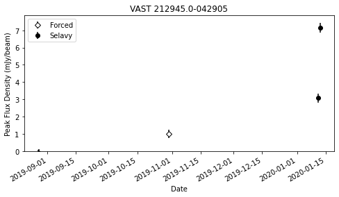
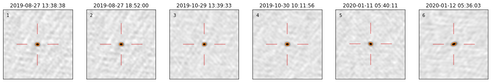
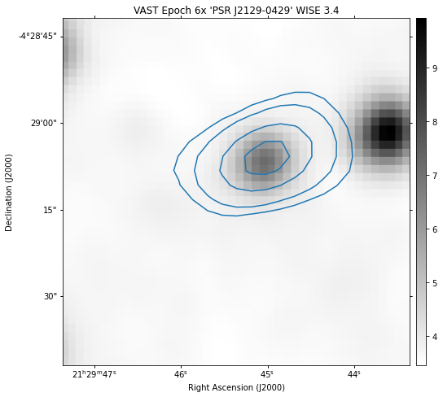

# Source

The `Source` class provides functionality to explore and analyse an astrophysical source as found in the VAST Pilot Survey or a detected using the [VAST Pipeline](https://vast-survey.org/vast-pipeline/){:target="_blank"}.
`Source` instances are returned by the [`Query.find_sources()`](../query#find_sources_results) method and the [`Pipeline.get_source()`](../pipeline#get_source) method.
With a `Source` instance it is possible to:

  * view the individual measurements from each epoch that make up the source,
  * plot a lightcurve,
  * create postage stamps of the measurements and save as FITS or PNG files,
  * create kvis annotation files or DS9 region files,
  * calculate the `η` and `V` variability metrics,
  * load image data from other surveys for the source location,
  * search [SIMBD](https://simbad.u-strasbg.fr/simbad/){:target="_blank"} or the [NASA/IPAC Extragalactic Database (NED)](https://ned.ipac.caltech.edu){:target="_blank"} for counterparts to the source,
  * and query the [CSIRO ASKAP Science Data Archive (CASDA)](https://research.csiro.au/casda/){:target="_blank"} for other ASKAP observations containing the source.

## Using the Source Component

!!! info "Info: Source Notebook Examples"
     Examples of using the `Source` component can be found in multiple notebooks.
     It is recommended to view the [`VAST Pipeline`](../../notebook-examples/vast-pipeline-example/) and 
     [`Query Source Search`](../../notebook-examples/source-search-example/) example notebooks to see how to use `Source` instances in practise.

### Initialising a Source Instance

!!! warning "Warning: Initialising Custom Sources"
    The parameters and data required to manually initialise a `Source` instance are somewhat specific and can be complex.
    The `Source` was mainly designed as an output for the [`Pipeline`](pipeline.md) and [`Query`](query.md) components to interact with astrophysical sources.

    Hence, while it is possible to manually initialise a `Source` instance, which is demonstrated below, it is not recommended outside of development context.

If a `Source` instance is required to be initialised then the first step is to import the `Source` class as demonstrated below.

!!! example
    ```python
    from vasttools.source import Source
    ```

#### Source Initialisation Options

A number of arguments are required to initialise a `Source` instance.
Those that are required are described below, along with an example.

!!! info ":fontawesome-regular-file-alt: Code Reference"
    See the [Code reference](../../reference/source/#vasttools.source.Source.__init__) section for all the initialisation options.

!!! warning "Warning: `Query` biased"
    The `Source` class was initially written for results from the `Query` component.
    Hence, some options are redundant for a `Source` created from the `Pipeline` component and are generally not required to be accurate for these cases.
    The [`Pipeline.get_source`](../../reference/pipeline/#vasttools.pipeline.PipeRun.get_source) method in shows how the `Pipeline` component currently initialises `Source` instances.

**`coord`**  
The [`SkyCoord`](https://docs.astropy.org/en/stable/api/astropy.coordinates.SkyCoord.html){:target="_blank"} object representing the the position of the source.

!!! note "Note: Planet Coords"
    `Source` instances that are defined as a planet required coordinates for each measurement.

**`name`**  
The string name of the source.

**`epochs`**  
A list of the epochs (as strings).
Must be the same length as the number of `measurements`.
The values can be arbitrary for a pipeline created `Source`.

**`fields`**  
A list of the field names (as strings). 
Must be the same length as the number of `measurements`.
This is mainly for `Source` instances created by using the `Query` component, and while required, the values can be arbitrary for a pipeline created `Source`.

**`stokes`**  
The stokes value of the source: `I`, `V`, `U` or `Q`.

**`primary_field`**  
The primary field of the source.
For pipeline created `Source` objects this can be entered as `None`.

**`crossmatch_radius`**  
The crossmatch radius used to construct the source, as a [`astropy.coordinates.Angle`](https://docs.astropy.org/en/stable/api/astropy.coordinates.Angle.html){:target="_blank"} instance.
For pipeline created `Source` objects this can be entered as `None`.

**`measurements`**  
The dataframe of individual measurements for the source.
This can either be the search output from the `Query` or the measurements dataframe of the source from the [VAST Pipeline](https://vast-survey.org/vast-pipeline/outputs/coldesc/#measurements){:target="_blank"}.

**`base_folder`**  
For `Query` produced sources this is the base directory of where the image data can be found relating to the source.
The standard VAST Pilot Survey data release structure is assumed (refer to [Configuration & Data Access](../../getting_started/configuration)).

!!! warning "Warning: Pipeline `base_folder`"
    For `Pipeline` produced `Source` instances the `base_folder` parameter should be entered as `None`.
    Instead, the columns `path`, `noise_path` and `measurements_path` should be added to the `measurements` dataframe containing the paths to the image, rms image and selavy component file, respectively.

!!! note "Note: Optional Arguments"
    Take note of optional arguments in the [Code reference](../../reference/source/#vasttools.source.Source.__init__) section to define certain characteristics of the source,
    including flags to denote the `Source` as a pipeline created source or if the `Source` is a planet.

!!! example "Example: Initialising a Source"
    Below is an example of the minimum required to create a `Source` object.
    
    To see how the `Pipeline` component creates a source please refer to the [`Pipeline.get_source`](../../reference/pipeline/#vasttools.pipeline.PipeRun.get_source) method in the Code Reference.
    ```python
    import astropy.units as u
    
    from vasttools.source import Source
    from astropy.coordinates import Angle, SkyCoord
    
    
    my_coord = SkyCoord("21h29m45.29s -04d29m11.9s")
    source_name = "PSR J2129-04"
    source_epochs = ['1', '2', '3', '4']
    source_fields = ['field_1', 'field_1', 'field_2', 'field_1']
    source_stokes = 'I'
    source_primary_field = 'field_1'
    crossmatch_radius = Angle(5.0 * u.arcsec)
    source_base_folder = "path/to/source/images/"
    
    my_source = Source(
        source_coord,
        source_name,
        source_epochs,
        source_fields,
        source_stokes,
        source_primary_field,
        source_crossmatch_radius,
        measurements_df,  # the measurements dataframe.
        source_base_folder,
    )
    ```

### Source Attributes

A `Source` instance contains several useful attributes.

!!! info ":fontawesome-regular-file-alt: Code Reference"
    See the [Code reference](../../reference/source/#vasttools.source.Source) section for all the `Source` attributes.

The two most commonly accessed attributes are:

**`Source.coord`**  
The right ascension and declination coordinates of the source as a `SkyCoord` object.

!!! example
    ```python
    my_source.coord
    # output:
    <SkyCoord (ICRS): (ra, dec) in deg
        (322.43870833, -4.48663889)>
    ```

**`Source.measurements`**  
Access to the measurements dataframe of the source.

!!! example
    ```python
    my_source.measurements
    ```

### Available Source Methods

The following methods are available with the `Source` instance.

!!!info "Info: Code Reference"
    Each method below has a link to the Code Reference section which provides full details of the method, including the arguments.

#### calc_eta_and_v_metrics

:fontawesome-regular-file-alt: [Code reference](../../reference/source/#vasttools.source.Source.calc_eta_and_v_metrics).

Calculates the `η` and `V` variability metrics.
By default the peak flux is used.

!!! example
    ```python
    eta, v = my_source.calc_eta_and_v_metrics()
    ```

#### calc_eta_metric

:fontawesome-regular-file-alt: [Code reference](../../reference/source/#vasttools.source.Source.calc_eta_metric).

Calculates the `η` variability metric.
By default the peak flux is used.

!!! example
    ```python
    eta = my_source.calc_eta_metric()
    ```

#### calc_v_metric

:fontawesome-regular-file-alt: [Code reference](../../reference/source/#vasttools.source.Source.calc_v_metric).

Calculates the `V` variability metric.
By default the peak flux is used.

!!! example
    ```python
    v = my_source.calc_v_metric()
    ```

#### casda_search

:fontawesome-regular-file-alt: [Code reference](../../reference/source/#vasttools.source.Source.casda_search).

Uses the [`astoquery CASDA Queries`](https://astroquery.readthedocs.io/en/latest/casda/casda.html){:target="_blank"} service to perform a search of the 
[CSIRO ASKAP Science Data Archive (CASDA)](https://research.csiro.au/casda/){:target="_blank"} for all ASKAP observations that contain the respective source.
By default a 20 arcsecond radius is used and unreleased data is included.
Results are returned as an [`astropy table`](https://docs.astropy.org/en/stable/table/index.html){:target="_blank"}.
`None` will be returned if there are no results.

!!! example
    ```python
    casda_results = my_source.casda_search()
    ```

#### get_cutout_data

:fontawesome-regular-file-alt: [Code reference](../../reference/source/#vasttools.source.Source.get_cutout_data).

This method fetches the cutout data that is required to generate the postage stamps and additional overlays.
The cutout data is stored in a dataframe as the attribute `Source.cutout_df`.

!!! note
    If a method that requires cutout data is run and this method has not been run, it is run automatically.
    I.e. it is not required to manually use this method before generating any cutouts.

!!! example
    ```python
    my_source.get_cutout_data()
    ```

#### make_png

:fontawesome-regular-file-alt: [Code reference](../../reference/source/#vasttools.source.Source.make_png).

The main method that generates all the PNG images that is called by other methods.
Note that this method can only produce a single epoch at a time, and required argument is the epoch of which to plot.
The result is returned a [`matplotlib.pyplot.figure`](https://matplotlib.org/stable/api/_as_gen/matplotlib.pyplot.figure.html){:target="_blank"} instance.
There are a wide variety of options that can style the output plot, please refer to the Code Reference to view them all.

!!! warning
    This method should ideally not be used directly.
    Instead it is accessed via using the wrapper png methods such as [`show_png_cutout`](#show_png_cutout) and [`show_all_png_cutouts`](#show_all_png_cutouts).

!!! note "Note: The Force Option"
    The cutout data is not fetched every time the method is called. 
    Once the cutout data has been fetched it won't be fetched again unless the `force` argument is set to `True`.
    Hence, if changing the size of the image after already using a method that fetches the cutout data, `force` must be set to `True` for it to be applied.
    ```python
    my_source.make_png(size=Angle(30 * u.arcsec), force=True)
    ```

!!! example
    Creating a `png` plot for the epoch labelled as `'1'`.
    ```python
    my_source.get_cutout_data('1')
    ```

??? example "Example png output"
    {: loading=lazy }

#### ned_search

:fontawesome-regular-file-alt: [Code reference](../../reference/source/#vasttools.source.Source.ned_search).

Uses the [`astoquery NED Queries`](https://astroquery.readthedocs.io/en/latest/ned/ned.html){:target="_blank"} service to perform a search of the 
[NASA/IPAC Extragalactic Database (NED)](https://ned.ipac.caltech.edu){:target="_blank"} for possible counterparts to the source.
By default a 20 arcsecond radius is used for the search.
Results are returned as an [`astropy table`](https://docs.astropy.org/en/stable/table/index.html){:target="_blank"}.
`None` will be returned if there are no results.

!!! example
    ```python
    ned_results = my_source.ned_search()
    ```

#### plot_lightcurve

:fontawesome-regular-file-alt: [Code reference](../../reference/source/#vasttools.source.Source.plot_lightcurve).

A method that returns a plot of the source lightcurve.
The result is returned a [`matplotlib.pyplot.figure`](https://matplotlib.org/stable/api/_as_gen/matplotlib.pyplot.figure.html){:target="_blank"} instance.
There are a wide variety of options that can style the output plot, please refer to the Code Reference to view them all.

!!! example
    ```python
    my_source.plot_lightcurve()
    ```

??? example "Example lightcurve output"
    {: loading=lazy }


#### save_all_ann

:fontawesome-regular-file-alt: [Code reference](../../reference/source/#vasttools.source.Source.save_all_ann).

A method to save the [kvis annotation files](https://www.atnf.csiro.au/computing/software/karma/user-manual/node17.html){:target="_blank"} for all epochs.
Refer to the method [`write_ann`](#write-ann) for saving the annotation file for an individual epoch.
The target source and all surrounding sources are included.
The files will be saved to the directory specified by the argument `outdir` in the instancing of the `Source`.
If this was not provided the default location is the current directory.

!!! note "Note: Change Cutout Size"
    To change the size of the cutout, re-fetch the cutout data using the [`get_cutout_data`](#get-cutout-data) method.

!!! example
    ```python
    my_source.save_all_ann()
    ```

#### save_all_fits_cutouts

:fontawesome-regular-file-alt: [Code reference](../../reference/source/#vasttools.source.Source.save_all_fits_cutouts).

A method to save the cutouts (or postage stamps) of each epoch as individual FITS files.
Refer to the method [`save_fits_cutout`](#save-fits-cutout) for saving the FITS of an individual epoch.
The FITS files will be saved to the directory specified by the argument `outdir` in the instancing of the `Source`.
If this was not provided the default location is the current directory.

!!! note "Note: The Force Option"
    The cutout data is not fetched every time the method is called. 
    Once the cutout data has been fetched it won't be fetched again unless the `force` argument is set to `True`.
    Hence, if changing the size of the image after already using a method that fetches the cutout data, `force` must be set to `True` for it to be applied.
    ```python
    my_source.save_all_fits_cutouts(size=Angle(30 * u.arcsec), force=True)
    ```

!!! example
    ```python
    my_source.save_all_fits_cutouts()
    ```

#### save_all_png_cutouts

:fontawesome-regular-file-alt: [Code reference](../../reference/source/#vasttools.source.Source.save_all_png_cutouts).

A method to save the cutouts (or postage stamps) of each epoch as individual png files.
Refer to the method [`save_png_cutout`](#save-png-cutout) for saving the png for an individual epoch.
The png files will be saved to the directory specified by the argument `outdir` in the instancing of the `Source`.
If this was not provided the default location is the current directory.

!!! note "Note: The Force Option"
    The cutout data is not fetched every time the method is called. 
    Once the cutout data has been fetched it won't be fetched again unless the `force` argument is set to `True`.
    Hence, if changing the size of the image after already using a method that fetches the cutout data, `force` must be set to `True` for it to be applied.
    ```python
    my_source.save_all_png_cutouts(size=Angle(30 * u.arcsec), force=True)
    ```

!!! warning
    This is not an analogous method to [`show_all_png_cutouts`](#show-all-png-cutouts).
    The method will produce the result from [`save_png_cutout`](#save-png-cutout) but for each epoch.
    The result from `show_all_png_cutouts` must be saved using the returned figure.

!!! example
    ```python
    my_source.save_all_png_cutouts()
    ```

#### save_all_reg

:fontawesome-regular-file-alt: [Code reference](../../reference/source/#vasttools.source.Source.save_all_reg).

A method to save the [DS9 region files](https://ds9.si.edu/doc/ref/region.html){:target="_blank"} for all epochs.
Refer to the method [`write_reg`](#write-reg) for saving the region file for an individual epoch.
The target source and all surrounding sources are included.
The files will be saved to the directory specified by the argument `outdir` in the instancing of the `Source`.
If this was not provided the default location is the current directory.

!!! note "Note: Change Cutout Size"
    To change the size of the cutout, re-fetch the cutout data using the [`get_cutout_data`](#get-cutout-data) method.

!!! example
    ```python
    my_source.save_all_reg()
    ```

#### save_fits_cutout

:fontawesome-regular-file-alt: [Code reference](../../reference/source/#vasttools.source.Source.save_fits_cutout).

A method to save the cutout (or postage stamp) of a single epoch in the FITS format.
The required argument is the epoch label of the epoch to be saved.
Refer to the code reference for all other available options. 
The file will be saved to the directory specified by the argument `outdir` in the instancing of the `Source`.
If this was not provided the default location is the current directory.

!!! note "Note: The Force Option"
    The cutout data is not fetched every time the method is called. 
    Once the cutout data has been fetched it won't be fetched again unless the `force` argument is set to `True`.
    Hence, if changing the size of the image after already using a method that fetches the cutout data, `force` must be set to `True` for it to be applied.
    ```python
    my_source.save_fits_cutout('1', size=Angle(30 * u.arcsec), force=True)
    ```

!!! example
    Saving the FITS cutout of the epoch labelled `1`.
    ```python
    my_source.save_fits_cutout('1')
    ```

#### save_png_cutout

:fontawesome-regular-file-alt: [Code reference](../../reference/source/#vasttools.source.Source.save_png_cutout).

A method to save the cutout (or postage stamp) of a single epoch as a png image.
The required argument is the epoch label of the epoch to be saved.
Refer to the code reference for all other available options. 
The file will be saved to the directory specified by the argument `outdir` in the instancing of the `Source`.
If this was not provided the default location is the current directory.

!!! note "Note: The Force Option"
    The cutout data is not fetched every time the method is called. 
    Once the cutout data has been fetched it won't be fetched again unless the `force` argument is set to `True`.
    Hence, if changing the size of the image after already using a method that fetches the cutout data, `force` must be set to `True` for it to be applied.
    ```python
    my_source.save_png_cutout('1', size=Angle(30 * u.arcsec), force=True)
    ```

!!! example
    Saving the png cutout of the epoch labelled `1`.
    ```python
    my_source.save_png_cutout('1')
    ```

??? example "Example png output"
    {: loading=lazy }

#### show_all_png_cutouts

:fontawesome-regular-file-alt: [Code reference](../../reference/source/#vasttools.source.Source.show_all_png_cutouts).

A method to produce a single image containing all the cutouts of the source, i.e. those from each epoch, displayed.
Refer to the code reference for all other available options.
The result is returned a [`matplotlib.pyplot.figure`](https://matplotlib.org/stable/api/_as_gen/matplotlib.pyplot.figure.html){:target="_blank"} instance.

!!! note "Note: The Force Option"
    The cutout data is not fetched every time the method is called. 
    Once the cutout data has been fetched it won't be fetched again unless the `force` argument is set to `True`.
    Hence, if changing the size of the image after already using a method that fetches the cutout data, `force` must be set to `True` for it to be applied.
    ```python
    my_source.show_all_png_cutouts(size=Angle(30 * u.arcsec), force=True)
    ```

!!! note "Note: Figure Size"
    The `figsize` and `columns` arguments can help adjust the layout of the multiple cutouts.
    Refer to the Code Reference for full details.

!!! example
    ```python
    all_cutouts_plot = my_source.show_all_png_cutouts()
    ```

??? example "Example png output"
    {: loading=lazy }

#### show_png_cutout

:fontawesome-regular-file-alt: [Code reference](../../reference/source/#vasttools.source.Source.show_png_cutout).

A method to produce the cutout (or postage stamp) of a single epoch as a png image.
The required argument is the epoch label of the epoch to be saved.
Refer to the code reference for all other available options.
The result is returned a [`matplotlib.pyplot.figure`](https://matplotlib.org/stable/api/_as_gen/matplotlib.pyplot.figure.html){:target="_blank"} instance.

!!! note "Note: The Force Option"
    The cutout data is not fetched every time the method is called. 
    Once the cutout data has been fetched it won't be fetched again unless the `force` argument is set to `True`.
    Hence, if changing the size of the image after already using a method that fetches the cutout data, `force` must be set to `True` for it to be applied.
    ```python
    my_source.show_png_cutout('1', size=Angle(30 * u.arcsec), force=True)
    ```

!!! example
    Saving the png cutout of the epoch labelled `1`.
    ```python
    epoch1_cutout = my_source.show_png_cutout('1')
    ```

??? example "Example png output"
    {: loading=lazy }

#### simbad_search

:fontawesome-regular-file-alt: [Code reference](../../reference/source/#vasttools.source.Source.simbad_search).

Uses the [`astoquery SIMBAD Queries`](https://astroquery.readthedocs.io/en/latest/simbad/simbad.html){:target="_blank"} service to perform a search of 
[SIMBD](https://simbad.u-strasbg.fr/simbad/){:target="_blank"} for possible counterparts to the source.
By default a 20 arcsecond radius is used for the search.
Results are returned as an [`astropy table`](https://docs.astropy.org/en/stable/table/index.html){:target="_blank"}.
`None` will be returned if there are no results.

!!! example
    ```python
    simbad_results = my_source.simbad_search()
    ```

#### skyview_contour_plot

:fontawesome-regular-file-alt: [Code reference](../../reference/source/#vasttools.source.Source.skyview_contour_plot).

Uses the [`astroquery Skyview Queries`](https://astroquery.readthedocs.io/en/latest/skyview/skyview.html){:target="_blank"} service to download and display a cutout from an available external survey
and overlay contours of the source from the selected epoch. 
The list of available surveys is shown on the linked page for the astroquery Skyview service.
The required arguments are the epoch to plot and the survey to query for a cutout image.
Contours are adjustable using the `contour_levels` argument, which defines the sigma levels of contours to use.
Refer to the Code Reference for full details on the arguments available.
The result is returned a [`matplotlib.pyplot.figure`](https://matplotlib.org/stable/api/_as_gen/matplotlib.pyplot.figure.html){:target="_blank"} instance.

!!! note "Note: The Force Option"
    The cutout data is not fetched every time the method is called. 
    Once the cutout data has been fetched it won't be fetched again unless the `force` argument is set to `True`.
    Hence, if changing the size of the image after already using a method that fetches the cutout data, `force` must be set to `True` for it to be applied.
    ```python
    my_source.skyview_contour_plot('6x', 'WISE 3.4', size=Angle(30 * u.arcsec), force=True)
    ```

!!! example
    Generating a cutout of the source location in the `WISE 3.4` survey along with a contour overlay from the source detection in epoch 6x.
    ```python
    wise_3_4_contour_epoch6x = my_source.skyview_contour_plot('6x', 'WISE 3.4')
    ```

??? example "Example png output"
    {: loading=lazy }

#### write_ann

:fontawesome-regular-file-alt: [Code reference](../../reference/source/#vasttools.source.Source.write_ann).

Saves the kvis annotation file equal to the generated cutout size for the provided epoch.
The target source and all surrounding sources are included.
Refer to the Code Reference for information on all the arguments.
The file will be saved to the directory specified by the argument `outdir` in the instancing of the `Source`.
If this was not provided the default location is the current directory.

!!! note "Note: Change Cutout Size"
    To change the size of the cutout, re-fetch the cutout data using the [`get_cutout_data`](#get-cutout-data) method.

!!! example
    Save the annotation file for the epoch labelled `1`.
    ```python
    my_source.write_ann('1')
    ```

#### write_measurements

:fontawesome-regular-file-alt: [Code reference](../../reference/source/#vasttools.source.Source.write_measurements).

A convenience method to save the measurements dataframe (i.e. `Source.measurements`) to a file.
The file will be saved to the directory specified by the argument `outdir` in the instancing of the `Source`.
If this was not provided the default location is the current directory.

!!! example
    ```python
    my_source.write_measurements()
    ```

#### write_reg

:fontawesome-regular-file-alt: [Code reference](../../reference/source/#vasttools.source.Source.write_reg).

Saves the ds9 region file of the generated cutout size for the provided epoch.
The target source and all surrounding sources are included.
Refer to the Code Reference for information on all the arguments.
The file will be saved to the directory specified by the argument `outdir` in the instancing of the `Source`.
If this was not provided the default location is the current directory.

!!! note "Note: Change Cutout Size"
    To change the size of the cutout, re-fetch the cutout data using the [`get_cutout_data`](#get-cutout-data) method.

!!! example
    Save the region file for the epoch labelled `1`.
    ```python
    my_source.write_reg('1')
    ```
