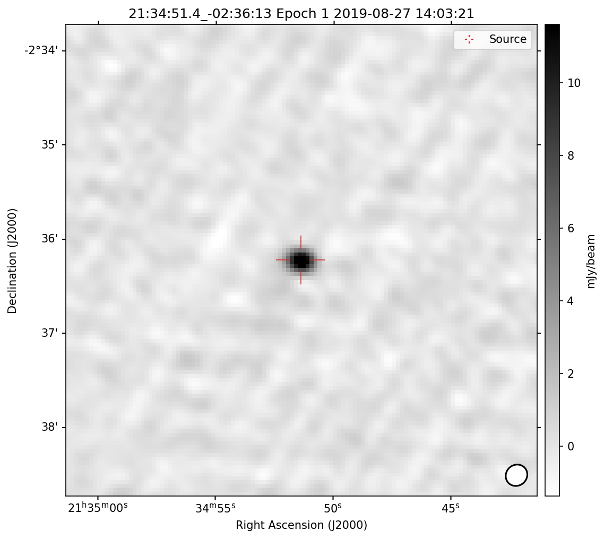

# Tools

The `Tools` sub-package is a mishmash of useful VAST-related functions that do not have a home elsewhere. It can be used for:

  * Filtering VAST data using gravitational wave skymaps and MOCs.
  * Adding a new epoch of observations to the package.
  * Plotting niceties
  
## Using the Tools Component

:fontawesome-regular-file-alt: [Code reference](../../reference/tools).  

### Skymaps and MOCs

#### skymap2moc
:fontawesome-regular-file-alt: [Code reference](../../reference/tools/#vasttools.tools.skymap2moc).

This function returns a MOC of the credible level of a provided skymap.
The arguments to this function are the path to the skymap file and the requested credible region.

!!! example "Example: Converting a gravitational wave skymap to MOC"
    Build a MOC of the 90% credible region of GW170817
    ```python
    from vasttools.tools import skymap2moc
    GW170817_moc = skymap2moc('gw170817.fits.gz', 0.9)
    ```

#### find_in_moc
:fontawesome-regular-file-alt: [Code reference](../../reference/tools/#vasttools.tools.find_in_moc).

This function returns the indices of sources that are contained within a given MOC, so that source catalogues can be filtered by sky region.
The arguments to this function are the MOC, the source DataFrame and an optional bool flagging whether the source dataframe is from the pipeline.
The value returned is a numpy array.

!!! note "Note: Coordinate Columns Names"
    The function assumes that the coordinate columns are defined as `ra` and `dec`.
    If the `pipe` flag is set to `True`, the function will assume the columns to be named `wavg_ra` and `wavg_dec`.

!!! example "Example: Finding which sources are contained in a MOC"
    Build a MOC of the 90% credible region of GW170817
    ```python
    from vasttools.tools import find_in_moc
    idx = find_in_moc(GW170817_moc, source_df, pipe=False)
    ```
    
#### add_credible_levels
:fontawesome-regular-file-alt: [Code reference](../../reference/tools/#vasttools.tools.add_credible_levels).

This function calculates the smallest credible region a source is contained in and adds it as a column, named `credible_level`, to the source dataframe in-place.
The arguments to this function are the path to the skymap file, the source DataFrame and an optional bool flagging whether the dataframe is from the pipeline.

!!! note "Note: Coordinate Columns Names"
    The function assumes that the coordinate columns are defined as `ra` and `dec`.
    If the `pipe` flag is set to `True`, the function will assume the columns to be named `wavg_ra` and `wavg_dec`.

!!! example "Example: Adding the credible level to sources dataframe"
    Add credible levels from the localisation of GW170817 to the sources dataframe
    ```python
    from vasttools.tools import add_credible_levels
    add_credible_levels('gw170817.fits.gz', source_df, pipe=False)
    ```

### Adding new epochs

!!! warning "Warning: VAST Data Release File Structure Expected"
    Unless the path is directly specified as an input, for the functions detailed below that either access or manipulate the VAST FITS files, it is assumed that the file structure is the same as the standard VAST Data release.
    See the [Data Access](../../getting_started/configuration/#data-access) page for details.

#### create_fields_csv
:fontawesome-regular-file-alt: [Code reference](../../reference/tools/#vasttools.tools.create_fields_csv).

This function creates a fields csv file for a given epoch using data from the [`ASKAP_SURVEYS`](https://bitbucket.csiro.au/projects/ASKAP_SURVEYS/repos/vast/browse){:target="_blank"} repository, which must be downloaded separately.
The arguments to this function are the epoch, the path to the repository and the path to the output directory, which defaults to the current directory.

!!! example "Example: Building a new fields csv"
    Build a new fields csv file for epoch 17
    ```python
    from vasttools.tools import create_fields_csv
    create_fields_csv('17', '/path/to/askap_surveys/db/')
    ```

#### add_obs_date
:fontawesome-regular-file-alt: [Code reference](../../reference/tools/#vasttools.tools.add_obs_date).

This function adds datetime data to all fits files in a given epoch.
The arguments to this function are the epoch, the image directory and the path to the epoch directory. If the path to the epoch directory is not provided it is generated from the `VAST_DATA_DIR` environment variable and the requested epoch.

!!! example "Example: Add datetime information to fits files"
    Add datetime info to all TILE images in epoch 1
    ```python
    from vasttools.tools import add_obs_date
    add_obs_date('01', 'TILES/STOKESI_IMAGES')
    ```

#### gen_mocs_image
:fontawesome-regular-file-alt: [Code reference](../../reference/tools/#vasttools.tools.gen_mocs_image).

This function creates a MOC and STMOC from a single fits image. It is unlikely that users would ever have to call this directly, and it should instead be called as part of [`gen_mocs_epoch`](./gen_mocs_epoch).
The arguments to this function are the path to the fits file, whether to write the MOC/STMOC to file or simply return them, and the directory to write them to.

!!! example "Example: Generate a MOC and STMOC for a single field"
    Generate a MOC for VAST0012-06A epoch 1.
    ```python
    from vasttools.tools import gen_mocs_image
    gen_mocs_image('/path/to/vast/data/EPOCH01/COMBINED/STOKESI_IMAGES/VAST_0012-06A.EPOCH01.I.fits')
    ```

#### gen_mocs_epoch
:fontawesome-regular-file-alt: [Code reference](../../reference/tools/#vasttools.tools.gen_mocs_epoch).

This function creates all MOCs and STMOCs for the provided epoch, and a new complete Pilot STMOC. It *should not* be run in the `vasttools/data/mocs` directory. Instead, users should run it in a separate directory, check the output and then manually copy the files across.
The arguments to this function is the path to the fits file.

!!! example "Example: Generate MOCs and STMOCs for a single epoch"
    Generate all MOC data for epoch 17 tiles
    ```python
    from vasttools.tools import gen_mocs_epoch
    gen_mocs_epoch('17', 'TILES/STOKESI_IMAGES')
    ```

### Plotting niceties

#### offset_postagestamp_axes
:fontawesome-regular-file-alt: [Code reference](../../reference/tools/#vasttools.tools.offset_postagestamp_axes).

This function updates a figure to display the axis labels as offsets from a central coordinate, rather than in absolute Right Ascension and Declination.
The required arguments to this function are the axis and the central coordinate. Refer to the Code Reference for information on all other the arguments.

!!! example "Example: Update a figure axis to use offset coordinates"
    Update an existing matplotlib axis (`ax`) to display axes as offset from `00:00:00, 00:00:00`.
    ```python
    from vasttools.tools import offset_postagestamp_axes
    from astropy.coordinates import SkyCoord
    import astropy.units as u
    import matplotlib.pyplot as plt
    
    fig, ax = plt.subplots()
    sc = SkyCoord("00:00:00", "00:00:00", unit=(u.hourangle, u.deg))
    offset_postagestamp_axes(ax, sc)
    ```

??? example "Absolute and offset coordinate axis labels"
    === "Absolute coordinates"
        {: loading=lazy }
    === "Offset coordinates"
        {: loading=lazy }

#### wise_color_color_plot

:fontawesome-regular-file-alt: [Code reference](../../reference/tools/#vasttools.tools.wise_color_color_plot).

This function returns a WISE color-color figure with common object classification regions
drawn as patches. A set of default object classes are provided, see
[WiseClass](../../reference/tools/#vasttools.tools.WiseClass).

!!! example "Example: Default WISE color-color figure"
    Get the default WISE color-color figure and plot a data point.

    ```python
    from vasttools.tools import wise_color_color_plot

    fig = wise_color_color_plot()
    ax = fig.axes[0]  # get the axes object
    # plot a data point in the QSO region
    ax.plot(3.0, 1.0, color="red", marker="*", markersize=10)
    ```

    {: loading=lazy }

The default style and text annotation of each object class can be modified by providing a new set
of configurations as an argument. Only the object classes contained in the passed argument
are modified, any others retain their default configuration. When overriding a patch style
or annotation, a complete [WisePatchConfig](../../reference/tools/#vasttools.tools.WisePatchConfig)
object must be provided, i.e. it must define the style, annotation text, and annotation
position. Partial overrides are not supported. `WisePatchConfig.style` should be a dict
containing any keyword arguments and values supported by `matplotlib.patches.PathPatch`.

!!! example "Example: WISE color-color style override"
    Override the style for the star object class. In this example, the
    color is changed to blue. By creating a copy of the default patch configuration, we
    are able to inherit the default annotation text and position. Using a copy also
    ensures that we do not change the default configurations.

    ```python
    from vasttools.tools import (
        wise_color_color_plot, WiseClass, WisePatchConfig, WISE_DEFAULT_PATCH_CONFIGS
    )

    # copy the default config for the stars object class
    stars_patch_config = WISE_DEFAULT_PATCH_CONFIGS[WiseClass.STARS].copy()
    # change the patch face color to blue
    stars_patch_config.style["fc"] = "blue"

    fig = wise_color_color_plot({WiseClass.STARS: stars_patch_config})
    ```

    {: loading=lazy }

To remove a patch, override the face and edge colors to be transparent and set the
annotation text to an empty string.

!!! example "Example: Remove an object class from a WISE color-color plot"
    This example removes the cool T-dwarfs patch from the WISE color-color plot by
    setting the face color and edge color to "none", and the annotation text to "".

    ```python
    from vasttools.tools import wise_color_color_plot, WiseClass, WisePatchConfig

    cool_patch_config = WisePatchConfig(
        style=dict(fc="none", ec="none"), annotation_text="", annotation_position=(0, 0)
    )
    fig = wise_color_color_plot({WiseClass.COOL_T_DWARFS: cool_patch_config})
    ```

    {: loading=lazy }
